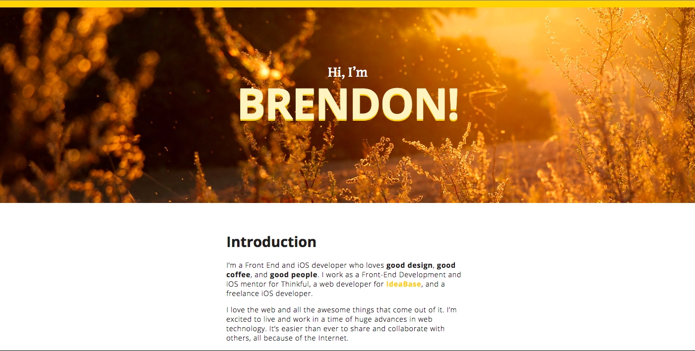
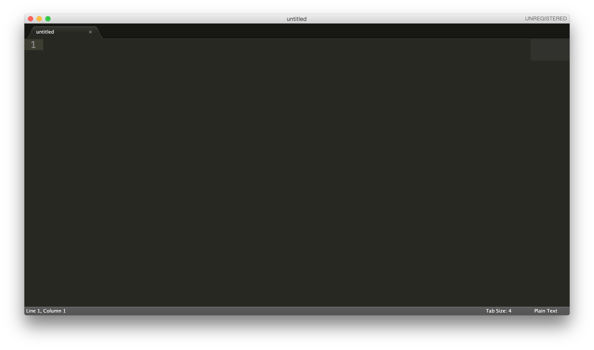
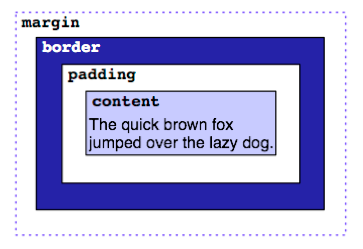

#Build your first website

##Welcome!

###Your mission if you choose to accept it

You're going to build and **launch live on the interwebs** your own amaze website like [this]() or [this]()! AND it will be totally free. Sound to good to be true? [False](http://i.imgur.com/A688v8m.png).

Your final product will be your own personal website that you can show off to your friends or even companies who you apply to.

Here is an example:

###Why learn HTML/CSS?

Because this stuff is important. Whether you're a business person formatting your emails, an aspiring web designer wanting to get your feet wet, or just someone who is interested and hasn't tried any sort of coding, scripting, or programming before, HTML and CSS are an essential part of your learning curve.

###Guide Philosophy

This guide is based on the principle of [project-driven learning](http://blog.thinkful.com/post/100829199278/project-based-v-s-project-driven-learning). We think learning by actually creating something is the best. We also think everything should be as clear and painless as possible. Therefore throughout this guide we will use GIF images to make everything as clear as possible.

###What do I need?

Yourself, a computer, and the internet. In this tutorial, we'll start from the very beginning. You don't need to know anything about HTML and CSS or anything about code to start so take a deep breath. You've got this.

##Setup and test run

Since a website is just a file, let's start by creating a file. In order to create a file we need a text editor.

###Steps

1) Download Sublime Text: Sublime Text is a text editor (like Microsoft Word or Google Docs) made for programmers. It can be downloaded [here](http://www.sublimetext.com/3). Download and open it. The initial page should look like this:

  

2) Do a test run: In this blank file type out the following code and save the file as "index.html" in a folder called "my website".

  <pre><!doctype html>
  <html>
    <head>
        <title>
            My Website
        </title>
    </head>
    <body>
        I can haz code?!  
    </body>
  </html></pre>

GIF HERE

3) Look at your file in an internet browser: Open your "index.html" file using your internet browser. On most browsers you do this by selecting Using file --> open file. Your browser should display the text "I can has code?!"

GIF HERE

4) [You did it](http://giphy.com/gifs/reaction-spoilers-outlander-LSNqpYqGRqwrS)! Awesome. **If you are having trouble with this step, tweet [@Thinkful](https://twitter.com/thinkful) and we can help you out.**

###What did you just do?

So, what are we looking at here? HTML, short for HyperText Markup Language, consists of these things called tags, which are words written between < and > characters, like <sometag>. All tags (with just a few exceptions that we'll talk about later) have a matching closing tag, which has the same name as the opening tag, except that it contains / after the first <, like </sometag>.

For example, <html> is one tag and the closing tag for it is </html>, same with <head> and </head> and <body> and </body>, and so on. You get it. The opening and closing tags together are an element (which also includes everything written in it). For example, <title>My Website</title> is one element. The text inside an element, in the title case, My Website, is called the content of an element.

So, if you look at our example, you can also put tags inside other tags (like we did with the <title> tags inside the <head> tags). This is called nesting elements. In this case, we would say that the <head> contains the <title>. Sometimes when you have a lot of nested tags, it's hard to keep track, so you have to format your code with spacing, as shown. Typically, inner tags are spaced more than their outer tags (just as <title> is indented further than <head>).

You'll notice that the first line has <!doctype html>. Every HTML document and website has to have this special tag, as it tells the browser what language we're using. This is one of those special tags I mentioned that doesn't need a closing tag.

On the second line, you can see a <html> tag. Everything in the website is contained by this tag, and the last line of your entire document will always be </html>.

Inside <html>, there are two elements: <head>and <body>. Contained in <head></head>, we will put all kinds of information for the browser that the user doesn't necessarily need to see. For now, we just have <title>. The content of <title> will be used for the name of the tab of the browser, and also by search engines.

On the other side of the planet, we have <body></body>. Everything visible to the user is contained in these tags. Right now, all that consists of is "I can haz code?!" Let's change that for fun. Replace "I can haz code?!", and then open the page in your browser. Neat!

##Wireframe your personal site

You are going to create a "wireframe". A wireframe is a sketch of your design.

###Steps

1) Sketch up your site: In the same way an architect draws a plan of a house before building, make sketch of what you're looking to build before you start coding. Here is an example:

Keep things simple for your first site. Remember that you can always go back and update with a new version! We've got plenty of examples to give you some inspiration. Try not to spend too much time making this perfect, the goal is to have something you can refer to and work off of when you code up your page.

Examples:
- list them here

2) Write your bio: This will probably take some time, but write the text you would like to display on your site.

Note: It's not a bad idea to write this in Sublime Text and save as a ".txt" file. This will easily allow you to copy and paste the answers into your html file later.

###What did you just do?

Wireframing is an important technique for web development and it will help you organize your thoughts before jumping into codig up your page.

##Structure your HTML

Let's create the different sections your sketched in your wireframe.

###Steps

1) Add new header, section, and footer tags inside of your <body></body> tags.

Your first section is a header, so use the <header> tags to create this section. Below that there are three content sections ("Introduction", "Where I'm From", and "About Me"). Use <section> tags for each of them. Lastly, use a <footer> tag for your footer. Your structure should now look like this:

<code>
<!doctype html>
<html>
    <head>
        <title>
            My Website
        </title>
    </head>
    <body>
        <header>   
        </header>
        <section>  
        </section>
        <section>  
        </section>
        <section>  
        </section>
        <footer>
        </footer>
    </body>
</html>
</code>

###What did you just do?

You now have the skeleton layout for your new "About Me" page. You're using a few important HTML5 elements - header, section, and footer. These elements let you divide the page into semantically meaningful partitions - this technique is called Semantic HTML. This means that your markup (HTML tags) match the conceptual model of your page. A web page has a header and a footer, and is usually divided up into sections, so it makes sense to make these divisions using the header, footer, and section tags.

In the past, you might have seen similar tutorials use the div tag for dividing the page. While the div tag does mean division and isn't technically wrong, it has no semantic meaning. Keep an eye out for more specific elements than just div in the future. There's sometimes a better HTML5 element to represent content than a plain div. The same can be said for using <tables> tags to create column sections -- it's bad practice.

##Header

Let's add the header! When you look at the header's design, you see three things -- 1) small text stating "Hi, I'm", 2) large text reading "Brendon!", and 3) a background image. Notice that in the header the small text and large text are centered both horizontally and vertically.

###Steps

1) Start by adding the text content to your HTML:

<code>
<header>  
    
Hi, I'm

    <h1>Name!</h1> 
</header>
<section>  
</section>
<section>  
</section>
<section>  
</section>
<footer>
</footer>
</code>

2) Center your header text: Now to get the elements in your header positioned correctly, you're going to need to use CSS. To target specific parts of the CSS you're going to use the "class" attribute.

Add the following code to yours:

<code>
<header class="masthead">  
    
Hi, I'm

    <h1 class="masthead-heading">Name!</h1> 
</header>
<section>  
</section>
<section>  
</section>
<section>  
</section>
<footer>
</footer>
</code>

***Theory:
The header tag now has a "class" attribute equal to "masthead". The word "masthead" is nothing special. You could have chosen any word to be our class attribute. "Masthead" is commonly used for headers with big background images like this.***

3) Style your masthead text: Now in our CSS, you can link styles to specific class attributes. Let's start by centering the text "Hi, I'm Name!". In the HTML, "Hi, I'm" has the "masthead-intro" class. To select the "masthead-intro" class, enter this code into your CSS:

<code>
.masthead-intro {

}
</code>

4) This selects the masthead-intro class. Now in between the curly braces let's type the following:

<code>
.masthead-intro {
    text-align: center;
}
</code>

5) The "masthead-heading" text is also text-aligned center. You could copy and paste the same code above but replace .masthead with .masthead-heading or you could just add the ".masthead-heading" above the ".masthead-intro" selector with a comma like this:

<code>
.masthead-heading,
.masthead-intro {
    text-align: center;
}
</code>

6) Now you need to get this content centered vertically. To do this you're going to use CSS's padding and margin properties. The best way to visualize this is to imagine what designers call "The Box Model."

***Theory:
Around any element are 3 layers of space: 1) padding, 2) border, and 3) margin.

Increasing padding increases the distance between your element and its border. Increasing a margin adds more space outside of your element's border.***

7) With this knowledge, add this to your CSS:

<code>
.masthead {
    padding: 6em 0;
}

.masthead-intro {
    margin-bottom: 0.1em;
}

.masthead-heading {
    margin-top: -0.2em;
}
</code>

***Theory:
By using padding for the "masthead" class you're making that class bigger. By using margin for the masthead-intro and "masthead-heading" class you're pushing other elements away from it.

Padding shorthand: In the "masthead" class you can indicate that there's padding: 6em 0;. The first number value (6em) represents padding top and bottom while the second number value (0) represents padding right and left.This is written in short hand. You could have instead wrote, padding-top: 6em, padding-bottom: 6em, padding-left: 0em, padding-right: 0em. There are several shorthand CSS properties that can be referenced here .
Using em: Ems are a unit of measure that isn't fixed like inches or centimeters. A centimenter is the same width anywhere in the world, ems are relative to the current font size. What's the current font size? That's dependent on your computer's browser. For most computer browsers, an "em" is equal to 16px. It's best practice to use ems in web development because it's common for content to be viewed on several different devices -- cell phones, tablets, desktop computers, even smart watches. Using ems makes it easier to adapt the content for each screen.
Negative measurements: You're using a negative margin to bring two elements closer together than the standard margin given.

The quality of your cover image greatly impacts the quality of your site. Check out [this blog post](https://news.layervault.com/stories/20663-stock-photos-that-dont-suck) for tons of awesome and free stock image sites. Hopefully you'll find something that you love. Make sure your images are at least 1200x800 so they will look good on a computer monitor. When you find one that you like, save it to your computer.***

8) To implement your background image like Brendon's example site, add the background-image property to your CSS. By adding this to a CSS class, the image you specify will be rendered in the background of the specified element. You'll need to have your image accessible to the internet for it to work on Codepen, so you can upload it to any image hosting service that you might be familiar with, including Photobucket , imgur , or tinypic . Then, just include the image's url in the background-image property to the .masthead class:

<code>
.masthead {
  background-image: url('http://i.imgur.com/dCgHi.jpg');
}
</code>

There are two other important properties to go with background-image: background-size and background-repeat. You can use background-size to control how the background stretches to fill the element. One commonly used setting for background-size is cover. This will make the element stretch to completely cover the specified element, but preserve its aspect ratio. It's one of the best settings to use for a large background image like a cover image. Still having trouble getting the header just right? In the next assignment an example solution is provided.

The example also has a little strip of color at the very top of the masthead cover image. Use the border-top property in your CSS to accomplish the same effect.

##Middle

###The HTML

Welcome back! As always, start by analyzing the wireframe.

Analyze the wireframe
When looking at the design's three middle sections, there are a few things you should notice:

The three sections are all marked with a prominent header and paragraph text.
The last section titled, "More About Me" has sub headers.
All of this content is centered in the middle of the page but the text is aligned left.
These observations will direct how you code these sections.

1.2.6_analysis.png

Coding
Go ahead and add the raw content into the HTML using <h1> tags for your prominent headers, <h2> tags for your secondary headers, and 
 tags for the paragraph texts. Make sure to use the same tags for the elements that are meant to look the same.

<section>
    <h1>Introduction</h1>
    
_INSERT_YOUR_3_SENTENCE_DESCRIPTION_HERE_

    
_INSERT_WHAT_IS_IMPORTANT_TO_YOU_PARAGRAPH_HERE_

</section>
<section>
    <h1>Where I'm From</h1>
    
_INSERT_YOUR_LOCATION_PARAGRAPH_HERE_

</section>
<section>
    <h1>More About Me</h1>
    <h2>What are your favorite hobbies?</h2>
    
_INSERT_YOUR_ANSWER_HERE_

    <h2>What's your dream job?</h2>
    
_INSERT_YOUR_ANSWER_HERE

    <h2>Another question?</h2>
    
_INSERT_YOUR_ANSWER_HERE

    <h2>Another question?</h2>
    
_INSERT_YOUR_ANSWER_HERE

</section>
Add dedicated CSS class attributes to each section. For section one add class="introduction-section". For section two add class="location-section". For section three add class="questions-section". Your code should now look like this:

<section class="introduction-section">
    <h1>Introduction</h1>
    
_INSERT_YOUR_3_SENTENCE_DESCRIPTION_HERE_

    
_INSERT_WHAT_IS_IMPORTANT_TO_YOU_PARAGRAPH_HERE_

</section>
<section class="location-section">
    <h1>Where I'm From</h1>
    
_INSERT_YOUR_LOCATION_PARAGRAPH_HERE_

</section>
<section class="questions-section">
    <h1>More About Me</h1>
    <h2>What are your favorite hobbies?</h2>
    
_INSERT_YOUR_ANSWER_HERE_

    <h2>What's your dream job?</h2>
    
_INSERT_YOUR_ANSWER_HERE

    <h2>Another question?</h2>
    
_INSERT_YOUR_ANSWER_HERE

    <h2>Another question?</h2>
    
_INSERT_YOUR_ANSWER_HERE

</section>
Theory: When to add classes
Classes are powerful attributes, and should be used thoughtfully. When deciding whether to add a class attribute, think about what unique styling the element will have. If all of your Header 1's will look the same, there's no need to use a class for it.

Even if there were slight differences in Header 1's per section, always remember that CSS is "cascading". You can target all of the <h1> tags within a section without defining a separate class for them.

Using this guiding principle, you will not add classes for any of the <h1>, <h2>, or 
 tags for this project.

###The CSS

As you begin positioning the middle section with CSS, remind yourself of the three observations made about this middle section.

The three sections are all marked with a prominent header and paragraph text.
The last section titled, "More About Me" has sub-headers.
All of this content is centered in the middle of the page but the text is aligned left.
Coding
Now that all of your HTML is marked up, it's time to adjust the CSS. All of the sections should be centered, while the text within each section is left-aligned. This is best way to center a section:

.introduction-section,
.location-section,
.questions-section {
    max-width: 38em;
    margin-left: auto;
    margin-right: auto;
}
The above code does the following to your content:

Sets a fixed "max-width" property.
Sets "margin-left" to "auto"
Sets "margin-right" to "auto"
Remember this strategy for centering block elements: By setting the max-width property, that element cannot be any wider then the specified width. margin-left:auto and margin-right: auto only works if you've defined a width.

You still need to add some margin to the top of each middle section with margin-top:2em;. Your CSS should now look like this:

.masthead-heading,
.masthead-intro {
    text-align: center;
}

.masthead {
    padding: 6em 0;
    background-image: url('http://i.imgur.com/lvXbgcg.jpg');
    background-repeat: no-repeat;
    background-size: cover;
    border-top: solid 1em #FFCF33;
}

.masthead-intro {
    margin-bottom: 0.1em;
}

.masthead-heading {
    margin-top: -0.2em;
}

.introduction-section,
.location-section,
.questions-section {
    max-width: 38em;
    margin-left: auto;
    margin-right: auto;
    margin-top: 2em;
}
Perfect. Now it's time to create the footer.

##Footer

As always, start by analyzing the wireframe.

Notice that the footer is text-aligned center just like the header. You also see that there are three links to social media accounts centered on one line.

footeranalysis.png

Coding
Back in your HTML, add the following class attributes to your footer tags and content. A few tags that you'll use include: <ul> which stands for unordered list, <li> which stands for list items within the unordered list, and <a> tag with an href attribute which is used for linked text. Your code should look like this:

<footer class="content-footer">
    
Say hi to me on these social networks:

    <ul class="social">
        <li><a href="_INSERT_GITHUB_URL_HERE_">GitHub</a></li>
        <li><a href="_INSERT_TWITTER_URL_HERE_">Twitter</a></li>
        <li><a href="_INSERT_GOOGLE+_URL_HERE_">Google+</a></li>
    </ul>
</footer>
Your entire HTML page should now look like this:

<header class="masthead">  
    
Hi, I'm

    <h1 class="masthead-heading">Name!</h1> 
</header>
<section class="introduction-section">
    <h1>Introduction</h1>
    
_INSERT_YOUR_3_SENTENCE_DESCRIPTION_HERE_

    
_INSERT_WHAT_IS_IMPORTANT_TO_YOU_PARAGRAPH_HERE_

</section>
<section class="location-section">
    <h1>Where I'm From</h1>
    
_INSERT_YOUR_LOCATION_PARAGRAPH_HERE_

</section>
<section class="questions-section">
    <h1>More About Me</h1>
    <h2>What are your favorite hobbies?</h2>
    
_INSERT_YOUR_ANSWER_HERE_

    <h2>What's your dream job?</h2>
    
_INSERT_YOUR_ANSWER_HERE

    <h2>Another question?</h2>
    
_INSERT_YOUR_ANSWER_HERE

    <h2>Another question?</h2>
    
_INSERT_YOUR_ANSWER_HERE

</section>
<footer class="content-footer">
    
Say hi to me on these social networks:

    <ul class="social">
        <li><a href="_INSERT_GITHUB_URL_HERE_">GitHub</a></li>
        <li><a href="_INSERT_TWITTER_URL_HERE_">Twitter</a></li>
        <li><a href="_INSERT_GOOGLE+_URL_HERE_">Google+</a></li>
    </ul>
    
Cover Image via <a href="http://unsplash.com">Unsplash</a>

</footer>
Make sure to take the time to really understand these changes:

You've given the entire footer the class "content-footer".
The text, "Say hi to me on these social networks:", is wrapped in paragraph tags.
The three links to GitHub, Twitter, and Google+ are within an unordered list tag (<ul>) with the class, "social", and each link is a list item (<li>) with links in them (<a>).
In CSS, you're now able to center the section. Add the ".content-footer" class to the code that centers your three middle sections. Your code should look like this:

.content-footer,
.introduction-section,
.location-section,
.questions-section {
    max-width: 38em;
    margin-left: auto;
    margin-right: auto;
    margin-top: 2em;
}
You're now able to center the footer text. Add the ".content-footer" class to the same selector used for text-aligning code in your header. Your code should look like this:

.masthead-intro,
.masthead-heading,
.content-footer {
    text-align: center;
}
Next, get all of the links in your list on the same line. To do this, you need to use the "display" property and the "inline-block" value. Your CSS should look like this:

.social > li {
    display: inline-block;
}
Use a specific selector here. .social > li selects all of the <li> tags within the .social class. The ">" selector means that only li elements that are direct children of the .social class will be displayed as inline-blocks.

Your footer needs a paragraph linking to the image source:

Cover Image via <a href="http://unsplash.com">Unsplash</a>

In your CSS, style this tiny paragraph so that the text is white. Your CSS should look like this:

.content-footer > p {
 color: white;
}
Theory: Centering things
So far, you've centered things using two different techniques: 1) text-align: center and 2) by setting the width of an element and declaring margin-left: auto;, margin-right:auto;. Why? One element was a "block level" element and the other was set to display as an "inline" element. Understanding the difference between "block" elements and "inline" elements will help you make accurate positioning decisions.

Block level elements expand to fill whatever width is available, and drop below other elements if they require more space. Inline elements exist within a section of text, so they run alongside each other like words in a sentence.

##Positioning and Layout

Your site is almost complete. The HTML is well organized and your CSS has positioned all of your elements to match your design's layout. You're well on your way. Before moving onto adjusting typography, recap a few important points from this assignment.

Key Positioning and Layout Take-aways:
Use appropriate HTML tags to incorporate "Semantic HTML".
Use "classes" to link specific HTML elements to CSS selectors.
Stack several CSS classes into one selector so they all have the same styles.
Target certain tags within a class by using the class > element selector, i.e. .social > li to target all of the list items within the ".social" class.
Use display: inline-block; to have all the items within a list display in a single horizontal line.
Use "em" instead of any fixed measurements (pt, inches, etc.)
Although relative, 1 em is usually equivalent to 16pt font size
Each block level element has 3 levels of space around it -- 1) padding, 2) border, and 3) margin.
Make block elements bigger by adding padding to move the border out. (The text won't get bigger, but the border around the text will grow.)
Adjust margins to push other elements away from your element. Margins keep the border the same but add additional space.
The best way to center a section is to 1) define the section's width, 2) margin-right: auto;, and 3) margin-left: auto;.
Before moving to the next section, Typography, let's make sure that our HTML is identical.

Your HTML should look like this:

<header class="masthead">  
    
Hi, I'm

    <h1 class="masthead-heading">Name!</h1> 
</header>
<section class="introduction-section">
    <h1>Introduction</h1>
    
_INSERT_YOUR_3_SENTENCE_DESCRIPTION_HERE_

    
_INSERT_WHAT_IS_IMPORTANT_TO_YOU_PARAGRAPH_HERE_

</section>
<section class="location-section">
    <h1>Where I'm From</h1>
    
_INSERT_YOUR_LOCATION_PARAGRAPH_HERE_

</section>
<section class="questions-section">
    <h1>More About Me</h1>
    <h2>What are your favorite hobbies?</h2>
    
_INSERT_YOUR_ANSWER_HERE_

    <h2>What's your dream job?</h2>
    
_INSERT_YOUR_ANSWER_HERE

    <h2>Another question?</h2>
    
_INSERT_YOUR_ANSWER_HERE

    <h2>Another question?</h2>
    
_INSERT_YOUR_ANSWER_HERE

</section>
<footer class="content-footer">
    
Say hi to me on these social networks:

    <ul class="social">
        <li><a href="_INSERT_GITHUB_URL_HERE_">GitHub</a></li>
        <li><a href="_INSERT_TWITTER_URL_HERE_">Twitter</a></li>
        <li><a href="_INSERT_GOOGLE+_URL_HERE_">Google+</a></li>
    </ul>
</footer>
Your CSS should look like this:

.content-footer,
.masthead-heading,
.masthead-intro {
  text-align: center;
}

.masthead {
    padding: 6em 0;
    background-image: url('http://i.imgur.com/lvXbgcg.jpg');
    background-repeat: no-repeat;
    background-size: cover;
    border-top: solid 1em #FFCF33;
}

.masthead-intro {
    margin-bottom: 0.1em;
}

.masthead-heading {
    margin-top: -0.2em;
}

.content-footer,
.introduction-section,
.location-section,
.questions-section {
    max-width: 38em;
    margin-left: auto;
    margin-right: auto;
    margin-top: 2em;
}

.social > li {
    display: inline-block;
}

##Upgrade your font

To upgrade typography in your web projects use a web fonts service. We'll use Google Fonts for this project because it's free. 

Coding
1) Go to the [Google Fonts website](https://www.google.com/fonts/).

NOTE: Don't worry if you're not a great designer or don't know a lot about typography! A good rule of thumb is to use two different typefaces per website. Check out [this page](http://hellohappy.org/beautiful-web-type/) for some great inspiration on some Google Fonts to pair together for this project(click on the font to go to the google collection). If you still don't know which ones to pick, you can use the example typefaces in the steps below.

Browse Google Fonts to check out some of the typefaces offered.

2) Search for "Open Sans" in the upper left corner of the page.

3) Click the "Add to Collection" button. You should see each typeface show up in the "Collection" panel at the bottom of the screen. Do the same thing for "Gentium Book Basic".

Collection panel on Google Fonts

4) Next click the "Use" button on the Collection panel. You'll be taken to a screen with a summary of the typefaces you're including. There will also be some numbered steps. Skip ahead to Step 3. It looks like this:

Google Fonts Use Step 3

5) Copy that snippet of HTML. This is a link tag and it's actually how you'll include CSS on a website that you build yourself. Let Codepen handle a lot of this work for you. Head back to Codepen and click the "Gear" icon at the top of the CSS panel. You'll see a pop out menu appear. Paste the link tag that you copied from Google Fonts into the field marked "External CSS File or Another Pen". Check out the screenshot below if you're not sure where this goes. You may need to trim your pasted content down to just the url ( http://fonts.googleapis.com/css?family=Open+Sans|Gentium+Book+Basic ).

Add Google Fonts to Codepen

Once you've completed that, change the font of the entire document to Open Sans. At the very top of the CSS page add:

body {
    /* Typography Declarations */
    color: #222222;
    font-size: 1em;
    font-family: "Open Sans", "Helvetica Neue", sans-serif;
}
Now, double-check that the font used across the entire page changes. If it did, you've successfully linked some Google Web Fonts.

Remember:

To style a font color, use color with a HEX code value. A HEX code is simply a 6 digit code that represents a color.
font-size lets you set how large the font appears. Using 1em for the font size means "whatever font size the user has specified." This allows users to apply assistive services of their browser to increase or decrease the font size of the page. Because you're using em for the rest of the measurement units, the layout will handle a variety of font sizes.

Notice the comma-delimited font names for the font-family property. This is known as a font stack, and it provides some "fallback" fonts in case something goes wrong with the web font selected. The browser will first try to use Open Sans. If it can't use Open Sans, it will try to use Helvetica Neue. If Helvetica Neue is not available, it will try to use the default sans-serif font for the system. On Windows, that's Arial. On Mac, that's Helvetica. This gives some control over fonts in case something goes wrong.

6) Next, add some typographic styling to the classes in your header section.

.masthead-intro {
    margin-bottom: 0.1em;
    font-family: "Gentium Book Basic", Georgia, serif;
    font-size: 2em;
}

.masthead-heading {
    margin-top: -0.2em;
    font-family: "Open Sans", "Helvetica Neue", sans-serif;
    font-weight: bold;
    font-size: 6em;
    letter-spacing: -0.02em;
    text-transform: uppercase;
}
There's a couple of new properties here as well: letter-spacing, font-weight, font-style, and text-transform.

Here are items to notice about what you've added to your CSS:

letter-spacing: Defines the tracking between subsequent letters in words. A negative value for letter-spacing makes letters closer together. A positive value makes them farther apart.
font-weight: Defines the weight of the font. Choices include bold, bolder, light, as well as numerical values that are defined by each typeface for fine-grained control.
text-transform: Controls special features about text display. In this case, it's used to make all letters uppercase.
7) Now, style the paragraphs in each of your sections.

.introduction > p,
.location > p,
.content-footer > p {
    /* Typography Declarations */
    font-weight: 300;
    letter-spacing: 0.05em;
}
8) Finally, style your questions.

.questions-section > h2 {
    /* Typography Declarations */
    font-family: "Gentium Book Basic", Georgia, serif;
    font-size: 1.2em;
    font-weight: bold;
}
Your final CSS should look like this (Notice that a few CSS comments have been added. These comments will not affect the code. They allow you to clearly see the additions.):

body {
    /* Typography Declarations */
    color: #222222;
    font-size: 1em;
    font-family: "Open Sans", "Helvetica Neue", sans-serif;
}

.content-footer,
.masthead-heading,
.masthead-intro {
  text-align: center;
}

.masthead {
    padding: 6em 0;
    background-image: url('http://i.imgur.com/lvXbgcg.jpg');
    background-repeat: no-repeat;
    background-size: cover;
    border-top: solid 1em #FFCF33;
}

.masthead-intro {
    /* Layout Declarations */
    margin-bottom: 0.1em;
    /* Typography Declarations */
    font-family: "Gentium Book Basic", Georgia, serif;
    font-size: 2em;
}

.masthead-heading {
    /* Layout Declarations */
    margin-top: -0.2em;
    /* Typography Declarations */
    font-family: "Open Sans", "Helvetica Neue", sans-serif;
    font-weight: bold;
    font-size: 6em;
    letter-spacing: -0.02em;
    text-transform: uppercase;
}

.content-footer,
.introduction-section,
.location-section,
.questions-section {
    max-width: 38em;
    margin-left: auto;
    margin-right: auto;
    margin-top: 2em;
}

.social > li {
    display: inline-block;
}

.introduction-section > p,
.location-section > p,
.content-footer > p {
    /* Typography Declarations */
    font-weight: 300;
    letter-spacing: 0.05em;
}

.questions-section > h2 {
    font-family: "Gentium Book Basic", Georgia, serif;
    font-size: 1.2em;
    font-weight: bold;
    /* Layout */
    margin: 2em 0 1em 0;
}

section > h1 {
    margin-top: 2em;
}
In the next lesson, you will spruce things up.

##Style your page

Finish styling your 'About Me' Page. Below you will find some hints on how to get started and effective techniques for creating well-designed pages. What comes next is up to you.

Once you've picked out an appropriate cover image, you can use a popular design tool called Adobe Kuler to help pick a color scheme from the image. You can then use the background-color property in your CSS to add colors to element backgrounds in your code. Colors in CSS are usually represented as hex code. This is in a format like #FFFFFF, with the leading # mark indicating that the value is hex. #000000 is hex for black and #FFFFFF is hex for white.

Here's an example for the background-color property that'll turn your footer red:

<code>
.content-footer {
  /* Red, Green, Blue: #RRGGBB */
  background-color: #FF0000;
}
If you want to apply color to text, as opposed to the background, you need to use the color property. This code will turn your <h1> text red:

h1 {
  color: #FF0000;
}
</code>

Other CSS Effects
Finally, you can add a ton of awesome visual effects with CSS. Here's a list of a few cool ones with links to tutorials if you want to try them out.

box-shadow: http://css-tricks.com/snippets/css/css-box-shadow/
text-shadow: http://css-tricks.com/snippets/css/css-text-shadow/
border-radius: http://css-tricks.com/almanac/properties/b/border-radius/

##Get your site live using Github pages

You've worked hard to get your site running locally. Now let's share it with the world! 

##Conclusion

Tweet your new site to us so we can brag about how awesome you are! Thanks for walking through our guide. If you have any feedback whatsoever tweet @Thinkful so we can update this guide.

