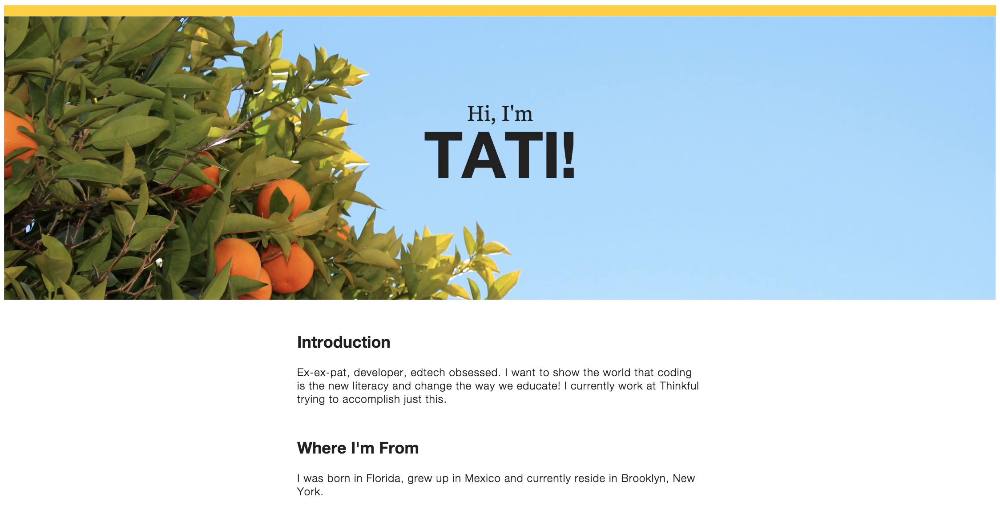

#Build your first website

##Welcome!

###Your mission:

You're going to build and **launch live** your own amazing "About Me" website! AND it will be totally free. Sound to good to be true? [False](http://i.imgur.com/A688v8m.png).

Here is [the example](http://tatianatylosky.github.io/personal-website-example/) we will be referring to throughout this guide:


###Guide Philosophy

This guide is based on the principle of [project-driven learning](http://blog.thinkful.com/post/100829199278/project-based-v-s-project-driven-learning). We believe the best way to learn a new skill is by creating a project of your own.

We also think learning should be as clear and painless as possible. Therefore throughout this guide we will use GIF images to help you follow along with each step. Also at the end of each section we'll go into detail explaining the theory behind what you just did.

###What do I need?

Yourself, a computer, and the internet. In this tutorial, we'll start from the very beginning. You don't need to know anything about HTML and CSS or anything about code to start. So take a deep breath, you've got this.

###Why learn HTML/CSS?

Because this stuff is important. Whether you're a business person formatting your emails, an aspiring web designer wanting to get your feet wet, or just someone who is interested and hasn't tried any sort of coding, scripting, or programming before, HTML and CSS are an essential part of your learning curve.

##Setup and test run

Overview: 
Let's start by creating a HTML file and opening it using a web browser.

Steps:

1. Create a folder where you are going to save your website's files such as "My Website".

2. Download Sublime [here](http://www.sublimetext.com/3) and open it (it's free!). The initial page should look like this:

  

    Sublime is a text editor made for programmers. In the same way you use Word to write essays, you use Sublime to write code.

3. In this blank file type out the following code. Next, save the file as "index.html" in the folder you just created.

    ```html
      <!doctype html>
      <html>
        <head>
            <title>
                My Website
            </title>
        </head>
        <body>
            I can haz code?!  
        </body>
      </html>
    ```

    GIF HERE

4. Open your "index.html" file using your internet browser. On most browsers you do this by selecting "file" --> "open file". Your browser should display the text "I can has code?!"

    GIF HERE

5. [You did it](http://giphy.com/gifs/reaction-spoilers-outlander-LSNqpYqGRqwrS)! Awesome. **If you are having trouble with this step, tweet [@Thinkful](https://twitter.com/thinkful) and we can help you out.** 


###Theory:
HTML (HyperText Markup Language) consists of these things called tags, which are words written between < and > characters, like `<sometag>`. There are normally matching opening and closing tags such as `<head>` and `</head>`. You can also put tags inside other tags (like we did with the `<title>` tags inside the `<head>` tags). This is called nesting elements. In this case, we would say that the `<head>` contains the `<title>`. Sometimes when you have a lot of nested tags, it's hard to keep track, so you have to format your code with spacing, as shown. Typically, inner tags are spaced more than their outer tags (just as `<title>` is indented further than `<head>`). Now let's go over those tags that you just created.

```html
  <!doctype html>
  <html>
    <head>
        <title>
            My Website
        </title>
    </head>
    <body>
        I can haz code?!  
    </body>
  </html>
```

Every HTML document and website has to have the special tag `<!doctype html>` because it tells the browser what language we're using. This tag is special because it does not need a closing tag. Everything in the website is contained by the `<html>` tag, and the last line of your entire document will always be `</html>`. Inside `<html>`, there are two elements: `<head>` and `<body>`. Contained in `<head></head>`, we will put all kinds of information for the browser that the user doesn't necessarily need to see. For now, we just have `<title>`. The content of `<title>` will be used for the name of the tab of the browser, and also by search engines. On the other side of the planet, we have `<body></body>`. Everything visible to the user is contained in these tags. Right now, all that consists of is "I can haz code?!" Let's change that for fun. Replace "I can haz code?!", and then open the page in your browser. Neat!

##Add Sections

Let's create the different parts of your website: header, sections, and footer (Refer back to our [example site](http://tatianatylosky.github.io/personal-website-example/) to see what this will look like).

Steps

1. Add new header, section, and footer tags inside of your `<body></body>` tags. The first is the header, so use the `<header>` tags. Below that there are three content sections ("Introduction", "Where I'm From", and "About Me"). Use `<section>` tags for each of them. Lastly, use a `<footer>` tag for your footer. Your structure should now look like this:


    ```html
    <!doctype html>
    <html>
        <head>
            <title>
                My Website
            </title>
        </head>
        <body>
            <header></header>
            <section></section>
            <section></section>
            <section></section>
            <footer></footer>
        </body>
    </html>
    ```

Notice we went ahead and took out the "I can haz code?!".

###Theory:

You now have the skeleton layout for your new "About Me" page. You're using a few important HTML5 elements - `<header></header>`, `<section></section>`, and `<footer></footer>`. These elements let you divide the page into semantically meaningful partitions - this technique is called Semantic HTML. This means that your markup (HTML tags) match the conceptual model of your page. A web page has a header and a footer, and is usually divided up into sections, so it makes sense to make these divisions using the header, footer, and section tags.

##Header

Let's add the header! When you look at the header's design, you see three things -- 1) small text stating "Hi, I'm", 2) large text reading "Tati!", and 3) a background image. Notice that in the header the small text and large text are centered both horizontally and vertically.


Steps:

1. Start by adding the text content to your HTML:

    ```html
    <header>  
        <p>Hi, I'm</p>
        <h1>Your Name!</h1> 
    </header>
    <section></section>
    <section></section>
    <section></section>
    <footer></footer>
    ```

2. Let's center your header text. To get the elements in your header positioned correctly, you're going to need to use CSS. To target specific parts of the CSS you're going to use the "class" attribute in your HTML.

    Add the following code to index.html file:

    ```html
    <header class="masthead">  
        <p class="masthead-intro">Hi, I'm</p>
        <h1 class="masthead-heading">Name!</h1> 
    </header>
    <section></section>
    <section></section>
    <section></section>
    <footer></footer>
    ```

    The header tag now has a "class" attribute equal to "masthead". The word "masthead" is nothing special. You could have chosen any word to be our class attribute. "Masthead" is commonly used for headers with big background images like this.

3. Create a new file called "style.css" in your folder. Add the following code to it.

    ```css
    body {
    background-color:red;
    }
    ```
    We are temporarily making your background red so that in the next step you can tell if you've linked your css file correctly! If you want to choose a (better color)[http://www.colors.commutercreative.com/grid/] go for it.

4. Next we'll link your CSS file to your html file. Add the following line of code to your index.html file in between the `<head></head>` tags.

    ```html
        <head>
            <title>
                My Website
            </title>
            <link rel="stylesheet" type="text/css" href="style.css">
        </head>
    ```

    Save your files and refresh your browser. Your page should have a colored background! If not go over the steps one more time. One common mistake is placing your css file (style.css) in a different folder than your html file. Make sure they are in the same folder.

5. Next we will style your masthead text. In CSS you can link styles to specific class attributes. Let's start by centering the text "Hi, I'm Name!". In the HTML, "Hi, I'm" has the "masthead-intro" class. To select the "masthead-intro" class, enter this code into your CSS:

    ```css
    .masthead-intro {

    }
    ```

5. This selects the masthead-intro class. Now in between the curly braces let's type the following:

    ```css
    .masthead-intro {
        text-align: center;
    }
    ```

6. The "masthead-heading" text is also text-aligned center. You could copy and paste the same code above but replace .masthead with .masthead-heading or you could just add the ".masthead-heading" above the ".masthead-intro" selector with a comma like this:

    ```css
    .masthead-heading,
    .masthead-intro {
        text-align: center;
    }
    ```

7. Now you need to get this content centered vertically. To do this you're going to use CSS's padding and margin properties. 

    ```css
    .masthead {
        padding-top: 6em;
        padding-bottom: 6em;
        padding-right: 0;
        padding-left: 0;
    }

    .masthead-intro {
        margin-bottom: 0.1em;
    }

    .masthead-heading {
        margin-top: -0.2em;
    }
    ```


    Check out [this blog post](https://news.layervault.com/stories/20663-stock-photos-that-dont-suck) for tons of awesome and free stock image sites. Hopefully you'll find something that you love. Make sure your images are at least 1200x800 so they will look good on a computer monitor. When you find one that you like, save it to your computer in the same folder as your `index.html` file.

9. To implement your background image like Brendon's example site, add the background-image property to your CSS. By adding this to a CSS class, the image you specify will be rendered in the background of the specified element. Include the image's url in the background-image property to the .masthead class:

    ```css
    .masthead {
        padding: 6em 0;
        background-image: url('http://photo.jpg');
        background-repeat: no-repeat;
        background-size: cover;
        border-top: solid 10px white;
    }
    ```

10. Refresh index.html file and check out your page!

Theory:

Box Model:


Around any element are 3 layers of space: 1) padding, 2) border, and 3) margin. Increasing padding increases the distance between your element and its border. Increasing  a margin adds more space outside of your element's border.

Using em: Ems are a unit of measure that isn't fixed like inches or centimeters. A centimenter is the same width anywhere in the world, ems are relative to the current font size. What's the current font size? That's dependent on your computer's browser. For most computer browsers, an "em" is equal to 16px. It's best practice to use ems in web development because it's common for content to be viewed on several different devices -- cell phones, tablets, desktop computers, even smart watches. Using ems makes it easier to adapt the content for each screen.

Negative measurements: You're using a negative margin to bring two elements closer together than the standard margin given.


##Middle

When looking at the design's three middle sections, there are a few things you should notice: The three sections are all marked with a prominent header and paragraph text. The last section titled, "More About Me" has sub headers. All of this content is centered in the middle of the page but the text is aligned left. These observations will direct how you code these sections.

Steps:

1. Go ahead and add your content into the `index.html` file using `<h1>` tags for your prominent headers, `<h2>` tags for your secondary headers, and `<p>` tags for the paragraph texts. Make sure to use the same tags for the elements that are meant to look the same.

    ```html
    <section>
        <h1>Introduction</h1>
        <p>_INSERT_YOUR_3_SENTENCE_DESCRIPTION_HERE_</p>
        <p>_INSERT_WHAT_IS_IMPORTANT_TO_YOU_PARAGRAPH_HERE_</p>
    </section>
    <section>
        <h1>Where I'm From</h1>
        <p>_INSERT_YOUR_LOCATION_PARAGRAPH_HERE_</p>
    </section>
    <section>
        <h1>More About Me</h1>
        <h2>What are your favorite hobbies?</h2>
        <p>_INSERT_YOUR_ANSWER_HERE_</p>
        <h2>What's your dream job?</h2>
        <p>_INSERT_YOUR_ANSWER_HERE</p>
        <h2>Another question?</h2>
        <p>_INSERT_YOUR_ANSWER_HERE</p>
        <h2>Another question?</h2>
        <p>_INSERT_YOUR_ANSWER_HERE</p>
    </section>
    ```

2. Add dedicated CSS class attributes to each section. For section one add `class="introduction-section"`. For section two add `class="location-section"`. For section three add `class="questions-section"`.

    ```html
    <section class="introduction-section">
        <h1>Introduction</h1>
        <p>_INSERT_YOUR_3_SENTENCE_DESCRIPTION_HERE_</p>
        <p>_INSERT_WHAT_IS_IMPORTANT_TO_YOU_PARAGRAPH_HERE_</p>
    </section>
    <section class="location-section">
        <h1>Where I'm From</h1>
        <p>_INSERT_YOUR_LOCATION_PARAGRAPH_HERE_</p>
    </section>
    <section class="questions-section">
        <h1>More About Me</h1>
        <h2>What are your favorite hobbies?</h2>
        <p>_INSERT_YOUR_ANSWER_HERE_</p>
        <h2>What's your dream job?</h2>
        <p>_INSERT_YOUR_ANSWER_HERE</p>
        <h2>Another question?</h2>
        <p>_INSERT_YOUR_ANSWER_HERE</p>
        <h2>Another question?</h2>
        <p>_INSERT_YOUR_ANSWER_HERE</p>
    </section>
    ```

3. Now that all of your HTML is marked up, it's time to adjust the CSS. All of the sections should be centered, while the text within each section is left-aligned. This is best way to center a section:

    ```css
    .introduction-section,
    .location-section,
    .questions-section {
        max-width: 38em;
        margin-left: auto;
        margin-right: auto;
    }
    ```

    NOTE: This is an excellent strategy for centering block elements! By setting the `max-width` property, that element cannot be any wider then the specified width. `margin-left: auto` and `margin-right: auto` will only work if you've defined a width.

4. You still need to add some margin to the top of each middle section with `margin-top: 2em`. Your CSS should now look like this:

    ```css
    .masthead-heading,
    .masthead-intro {
        text-align: center;
    }

    .masthead {
        padding: 6em 0;
        background-image: url('http://i.imgur.com/lvXbgcg.jpg');
        background-repeat: no-repeat;
        background-size: cover;
        border-top: solid 1em #FFCF33;
    }

    .masthead-intro {
        margin-bottom: 0.1em;
    }

    .masthead-heading {
        margin-top: -0.2em;
    }

    .introduction-section,
    .location-section,
    .questions-section {
        max-width: 38em;
        margin-left: auto;
        margin-right: auto;
        margin-top: 2em;
    }
    ```

Theory:
Classes are powerful attributes, and should be used thoughtfully. When deciding whether to add a class attribute, think about what unique styling the element will have. If all of your Header 1's will look the same, there's no need to use a class for it.

Even if there were slight differences in Header 1's per section, always remember that CSS is "cascading". You can target all of the `<h1>` tags within a section without defining a separate class for them.

Using this guiding principle, you will not add classes for any of the `<h1>`, `<h2>`, or `<p>` tags for this project

Perfect. Now it's time to create the footer.

##Footer

In our [example site](http://tatianatylosky.github.io/personal-website-example/), notice that the footer is text-aligned center just like the header. You also see that there are three links to social media accounts centered on one line.

Steps:

1. In your `index.html` file add the following class attributes to your footer tags and content. A few tags that you'll use include: `<ul>` which stands for unordered list, `<li>` which stands for list items within the unordered list, and `<a>` tag with an href attribute which is used to link text.

    ```html
    <footer class="content-footer">
        <p>Say hi to me on these social networks:</p>
        <ul class="social">
            <li><a href="_INSERT_GITHUB_URL_HERE_">GitHub</a></li>
            <li><a href="_INSERT_TWITTER_URL_HERE_">Twitter</a></li>
            <li><a href="_INSERT_GOOGLE+_URL_HERE_">Google+</a></li>
        </ul>
    </footer>
    ```

    Your entire HTML page should now look like this:

    ```html
    <header class="masthead">  
        <p class="masthead-intro">Hi, I'm</p>
        <h1 class="masthead-heading">Name!</h1> 
    </header>
    <section class="introduction-section">
        <h1>Introduction</h1>
        <p>_INSERT_YOUR_3_SENTENCE_DESCRIPTION_HERE_</p>
        <p>_INSERT_WHAT_IS_IMPORTANT_TO_YOU_PARAGRAPH_HERE_</p>
    </section>
    <section class="location-section">
        <h1>Where I'm From</h1>
        <p>_INSERT_YOUR_LOCATION_PARAGRAPH_HERE_</p>
    </section>
    <section class="questions-section">
        <h1>More About Me</h1>
        <h2>What are your favorite hobbies?</h2>
        <p>_INSERT_YOUR_ANSWER_HERE_</p>
        <h2>What's your dream job?</h2>
        <p>_INSERT_YOUR_ANSWER_HERE</p>
        <h2>Another question?</h2>
        <p>_INSERT_YOUR_ANSWER_HERE</p>
        <h2>Another question?</h2>
        <p>_INSERT_YOUR_ANSWER_HERE</p>
    </section>
    <footer class="content-footer">
        <p>Say hi to me on these social networks:</p>
        <ul class="social">
            <li><a href="_INSERT_GITHUB_URL_HERE_">GitHub</a></li>
            <li><a href="_INSERT_TWITTER_URL_HERE_">Twitter</a></li>
            <li><a href="_INSERT_GOOGLE+_URL_HERE_">Google+</a></li>
        </ul>
    </footer>
    ```

    You've given the entire footer class `"content-footer"`.
    The text, `"Say hi to me on these social networks:"`, is wrapped in paragraph tags. The three links to GitHub, Twitter, and Google+ are within an unordered list tag (`<ul>`) with the class, `"social"`, and each link is a list item (`<li>`) with links in them (`<a>`).

2. In CSS, you're now able to center the section. Add the `.content-footer class to the code that centers your three middle sections. Your code should look like this:

    ```css
    .content-footer,
    .introduction-section,
    .location-section,
    .questions-section {
        max-width: 38em;
        margin-left: auto;
        margin-right: auto;
        margin-top: 2em;
    }
    ```

3. Add the `.content-footer` class to the same selector used for text-aligning code in your header to center the footer text. 

    ```css
    .masthead-intro,
    .masthead-heading,
    .content-footer {
        text-align: center;
    }
    ```

4. Next, get all of the links in your list on the same line. To do this, you need to use the `display` property and the `inline-block` value. Your CSS should look like this:

    ```css
    .social > li {
        display: inline-block;
    }
    ```

    Use a specific selector here. `.social > li` selects all of the `<li>`s tags within the `.social` class. The `>` selector means that only li elements that are direct children of the `.social` class will be displayed as inline-blocks.

5. In your CSS, style this tiny paragraph so that the text is white. Your CSS should look like this:

    ```css
    .content-footer > p {
        color: white;
    }
    ```

Theory:

So far, you've centered things using two different techniques: 1) text-align: center and 2) by setting the width of an element and declaring margin-left: auto;, margin-right:auto;. Why? One element was a "block level" element and the other was set to display as an "inline" element. Understanding the difference between "block" elements and "inline" elements will help you make accurate positioning decisions.

Block level elements expand to fill whatever width is available, and drop below other elements if they require more space. Inline elements exist within a section of text, so they run alongside each other like words in a sentence.

##Check your code

Your HTML should look like this:

```html
<header class="masthead">  
    <p class="masthead-intro">Hi, I'm</p>
    <h1 class="masthead-heading">Name!</h1> 
</header>
<section class="introduction-section">
    <h1>Introduction</h1>
    <p>_INSERT_YOUR_3_SENTENCE_DESCRIPTION_HERE_</p>
    <p>_INSERT_WHAT_IS_IMPORTANT_TO_YOU_PARAGRAPH_HERE_</p>
</section>
<section class="location-section">
    <h1>Where I'm From</h1>
    <p>_INSERT_YOUR_LOCATION_PARAGRAPH_HERE_</p>
</section>
<section class="questions-section">
    <h1>More About Me</h1>
    <h2>What are your favorite hobbies?</h2>
    <p>_INSERT_YOUR_ANSWER_HERE_</p>
    <h2>What's your dream job?</h2>
    <p>_INSERT_YOUR_ANSWER_HERE</p>
    <h2>Another question?</h2>
    <p>_INSERT_YOUR_ANSWER_HERE</p>
    <h2>Another question?</h2>
    <p>_INSERT_YOUR_ANSWER_HERE</p>
</section>
<footer class="content-footer">
    <p>Say hi to me on these social networks:</p>
    <ul class="social">
        <li><a href="_INSERT_GITHUB_URL_HERE_">GitHub</a></li>
        <li><a href="_INSERT_TWITTER_URL_HERE_">Twitter</a></li>
        <li><a href="_INSERT_GOOGLE+_URL_HERE_">Google+</a></li>
    </ul>
</footer>
```


Your CSS should look like this:

```css
.content-footer,
.masthead-heading,
.masthead-intro {
  text-align: center;
}

.masthead {
    padding: 6em 0;
    background-image: url('http://i.imgur.com/lvXbgcg.jpg');
    background-repeat: no-repeat;
    background-size: cover;
    border-top: solid 1em #FFCF33;
}

.masthead-intro {
    margin-bottom: 0.1em;
}

.masthead-heading {
    margin-top: -0.2em;
}

.content-footer,
.introduction-section,
.location-section,
.questions-section {
    max-width: 38em;
    margin-left: auto;
    margin-right: auto;
    margin-top: 2em;
}

.social > li {
    display: inline-block;
}
```

##Key Layout Take-aways:

Your site is almost complete. The HTML is well organized and your CSS has positioned all of your elements to match your design's layout. You're well on your way. Before moving onto adjusting typography and colors, recap a few important points from this assignment.

- Use appropriate HTML tags to incorporate "Semantic HTML".

- Use "classes" to link specific HTML elements to CSS selectors.
Stack several CSS classes into one selector so they all have the same styles.

- Target certain tags within a class by using the class > element selector, i.e. .social > li to target all of the list items within the ".social" class.

- Use display: inline-block; to have all the items within a list display in a single horizontal line.

- Use "em" instead of any fixed measurements (pt, inches, etc.)
Although relative, 1 em is usually equivalent to 16pt font size
Each block level element has 3 levels of space around it -- 1) padding, 2) border, and 3) margin.

- Make block elements bigger by adding padding to move the border out. (The text won't get bigger, but the border around the text will grow.)

- Adjust margins to push other elements away from your element. Margins keep the border the same but add additional space.

- The best way to center a section is to 1) define the section's width, 2) margin-right: auto;, and 3) margin-left: auto;.

##Style your font

Let's change our fonts!

1. Change the font of the entire document to Helvetica Neue. At the very top of your style.css file add:

    ```css
    body {
        /* Typography Declarations */
        color: #222222;
        font-size: 1em;
        font-family: "Helvetica Neue", "Open Sans", sans-serif;
    }
    ```

    To style a font color, use `color` with a HEX code value. A HEX code is simply a 6 digit code that represents a color. `font-size` lets you set how large the font appears. Using 1em for the font size means "whatever font size the user has specified." This allows users to apply assistive services of their browser to increase or decrease the font size of the page. Because you're using em for the rest of the measurement units, the layout will handle a variety of font sizes.

2. Style the fonts ofyour `masthead-intro` and `masthead-heading` classes.

    ```css
    .masthead-intro {
        margin-bottom: 0.1em;
        font-family: "Gentium Book Basic", Georgia, serif;
        font-size: 2em;
    }

    .masthead-heading {
        margin-top: -0.2em;
        font-family: "Open Sans", "Helvetica Neue", sans-serif;
        font-weight: bold;
        font-size: 6em;
        letter-spacing: -0.02em;
        text-transform: uppercase;
    }
    ```

3. Now, style the paragraphs in each of your sections.
        
    ```css
    .introduction > p,
    .location > p,
    .content-footer > p {
        /* Typography Declarations */
        font-weight: 300;
        letter-spacing: 0.05em;
    }
    ```

    Finally, style your questions.

    ```css
    .questions-section > h2 {
        /* Typography Declarations */
        font-family: "Gentium Book Basic", Georgia, serif;
        font-size: 1.2em;
        font-weight: bold;
    }
    ```

4. Your final CSS should look like this (Notice that a few CSS comments have been added. These comments will not affect the code. They allow you to clearly see the additions.):

    ```css
    body {
        /* Typography Declarations */
        color: #222222;
        font-size: 1em;
        font-family: "Open Sans", "Helvetica Neue", sans-serif;
    }

    .content-footer,
    .masthead-heading,
    .masthead-intro {
      text-align: center;
    }

    .masthead {
        padding: 6em 0;
        background-image: url('http://i.imgur.com/lvXbgcg.jpg');
        background-repeat: no-repeat;
        background-size: cover;
        border-top: solid 1em #FFCF33;
    }

    .masthead-intro {
        /* Layout Declarations */
        margin-bottom: 0.1em;
        /* Typography Declarations */
        font-family: "Gentium Book Basic", Georgia, serif;
        font-size: 2em;
    }

    .masthead-heading {
        /* Layout Declarations */
        margin-top: -0.2em;
        /* Typography Declarations */
        font-family: "Open Sans", "Helvetica Neue", sans-serif;
        font-weight: bold;
        font-size: 6em;
        letter-spacing: -0.02em;
        text-transform: uppercase;
    }

    .content-footer,
    .introduction-section,
    .location-section,
    .questions-section {
        max-width: 38em;
        margin-left: auto;
        margin-right: auto;
        margin-top: 2em;
    }

    .social > li {
        display: inline-block;
    }

    .introduction-section > p,
    .location-section > p,
    .content-footer > p {
        /* Typography Declarations */
        font-weight: 300;
        letter-spacing: 0.05em;
    }

    .questions-section > h2 {
        font-family: "Gentium Book Basic", Georgia, serif;
        font-size: 1.2em;
        font-weight: bold;
        /* Layout */
        margin: 2em 0 1em 0;
    }

    section > h1 {
        margin-top: 2em;
    }
    ```

Now you should have beautiful fonts for your page! In the next section we'll add a splash of color.

##Add **extra style** to your page

Let's add the final touches to get your site looking beautful now that we have the formatting down. If you've already picked out an appropriate cover image, you can uses a popular design tool called [Adobe Kuler](https://color.adobe.com/) to help pick a color scheme from the image. You can then use the background-color property in your CSS to add colors to element backgrounds in your code. Colors in CSS are usually represented as hex code. This is in a format like #FFFFFF, with the leading # mark indicating that the value is hex. #000000 is hex for black and #FFFFFF is hex for white.

1. Change your footer color. Here's an example for the background-color property that'll turn your footer red:

    ```css
    .content-footer {
      /* Red, Green, Blue: #RRGGBB */
      background-color: #FF0000;
    }
    ```

2. Change your font color. If you want to apply color to text, as opposed to the background, you need to use the color property. This code will turn your <h1> text red:

    ```css
    h1 {
      color: #FF0000;
    }
    ```

Other CSS Effects
Finally, you can add a ton of awesome visual effects with CSS. Here's a list of a few cool ones with links to tutorials if you want to try them out.

box-shadow: http://css-tricks.com/snippets/css/css-box-shadow/
text-shadow: http://css-tricks.com/snippets/css/css-text-shadow/
border-radius: http://css-tricks.com/almanac/properties/b/border-radius/

Theory:
??? 

##Challenge: Get your site live using Github pages

You've worked hard to get your site running locally. Now let's share it with the world!

git checkout -b gh-pages

git push origin gh-pages

The URL will be at:

http://username.github.io/repo-name


##Conclusion

Tweet your new site to us so we can brag about how awesome you are! Thanks for walking through our guide. If you have any feedback whatsoever tweet @Thinkful so we can update this guide.


